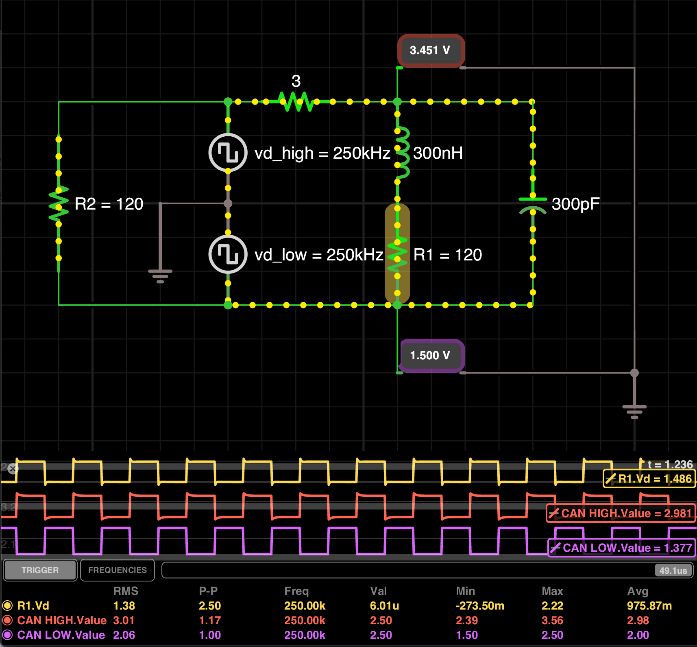

# A simple setup to simulate CAN Bus Wiring with the Tool iCircuit

### The Tool [iCircuit](http://icircuitapp.com/) is available for Mac/iOS, Windows and Android

#### The primary reason was to explain the overshooting I see from time to time when troubleshooting CAN Bus networks

Overshooting and Ringing due to inductive and capacitive effects (LC-Circuit)

### This simulation should be taken with a grain of salt as the accuracy of iCircuit seems to be limited at higher frequencies!

#### To-DO:
- use LTSpice to simulate the same
