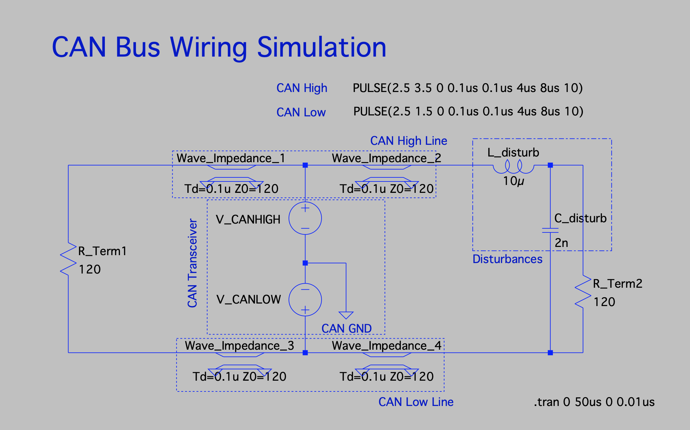
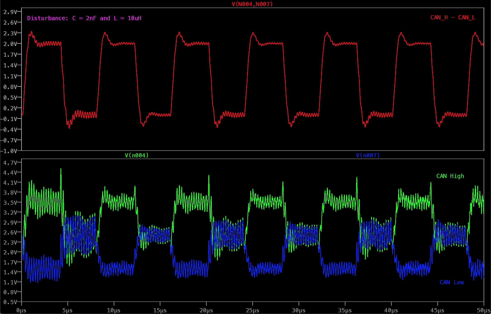
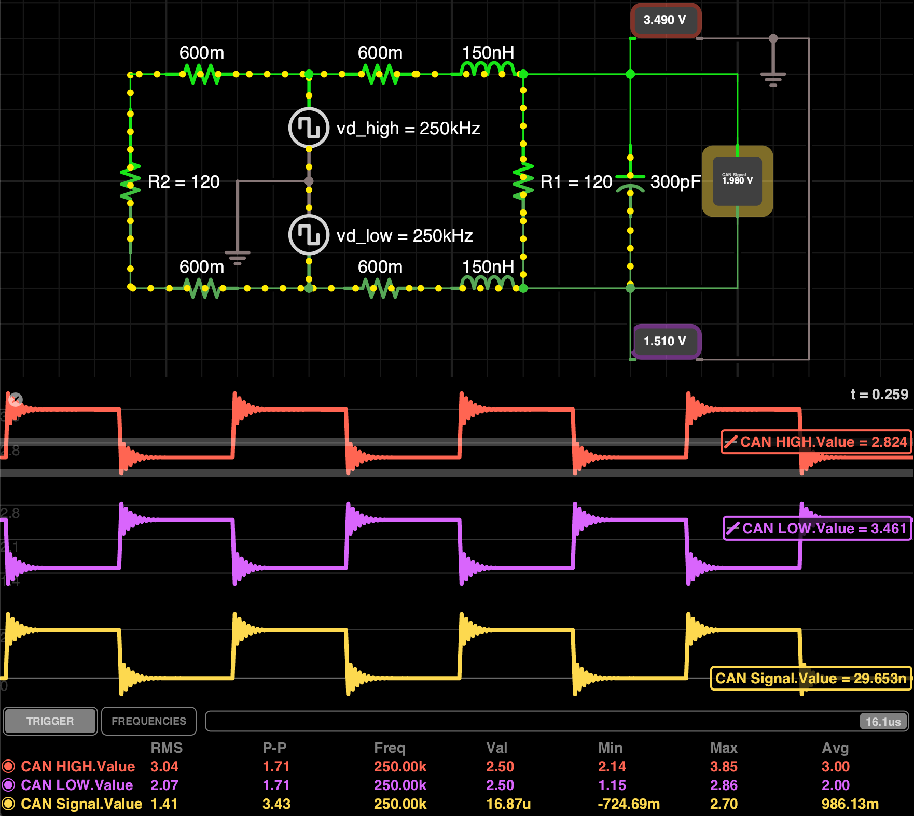

# Simulating CAN Bus Wiring with LTspice and iCircuit

#### The primary motivation was to explain the overshooting I see from time to time when troubleshooting CAN Bus networks

#### To anticipate it, the preferred tool is LTspice due to significantly better accuracy.

## Simulation with LTspice

### Basic Setup

### "Good" CAN Bus

### A few disturbances

### Strong disturbances

The appropriate FFT

## Simulation with iCircuit

### The Tool [iCircuit](http://icircuitapp.com/) is available for Mac/iOS, Windows and Android

#### This simulation should be taken with a grain of salt as the accuracy of iCircuit seems to be limited at higher frequencies!
#### I was also not able to figure out how to improve the simulation accuracy or decrease Tstep
